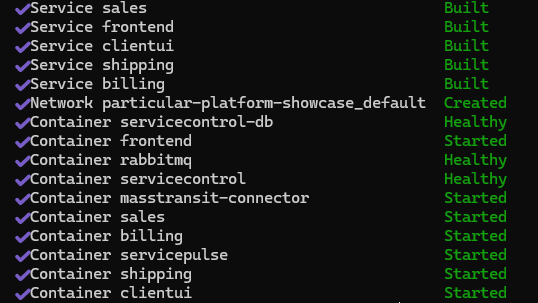
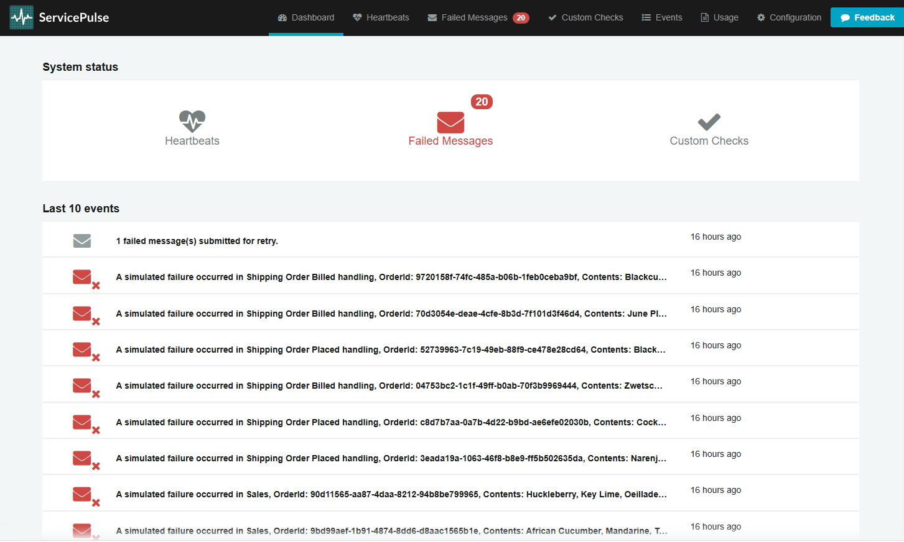
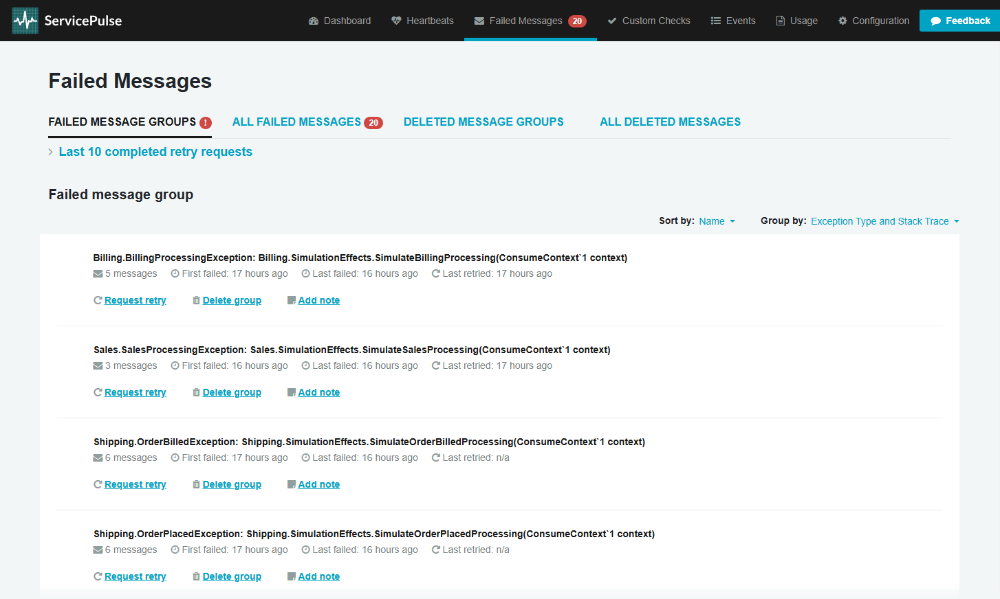
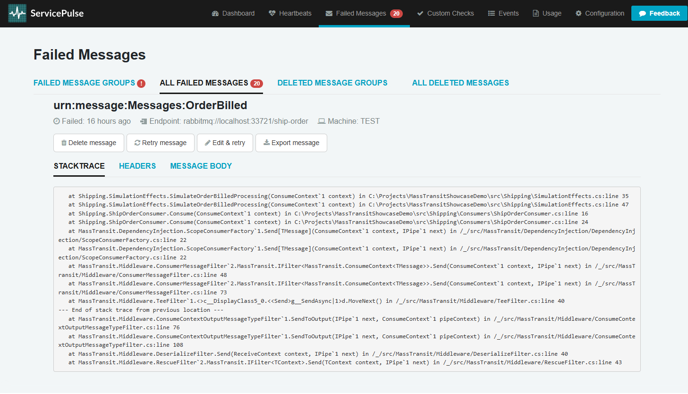
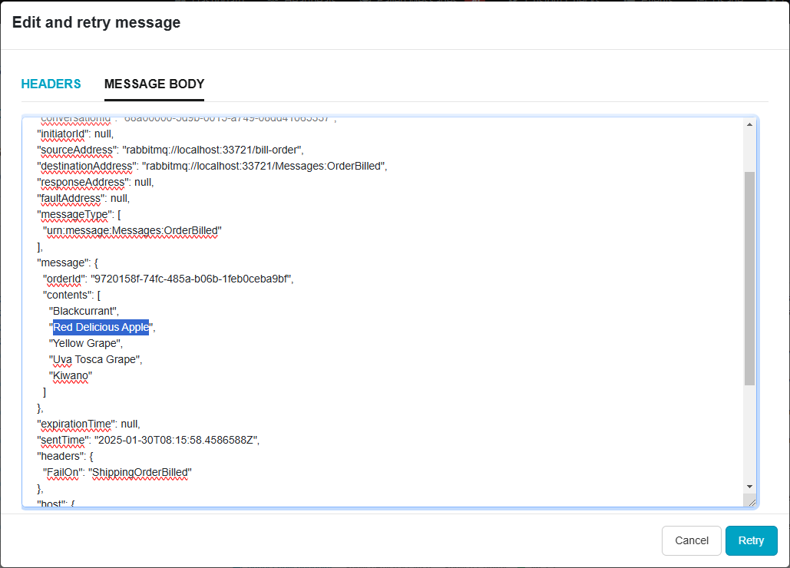

# MassTransit Error Management - Showcase

This showcase consists of 4 processes hosting MassTransit message producers and consumers that implement a simplified order processing logic from an e-commerce system.


## Launching the Showcase in Docker with **RabbitMQ**

To help getting started we have created a few docker compose files that orchestrate all this setup for you.

- First, make sure you've pulled down the repository to your machine.
- Second, open a terminal and navigate to the `src` folder in your local copy of the repository.
- Third, run the following command:

```cmd
docker compose -p particular-platform-showcase -f docker-compose-base.yml -f compose-rabbitmq.yml --env-file rabbit.env up -d --build
```



### (Alternative) Run in Docker with **Azure Service Bus**

<details>

The showcase can also be run using Azure Service Bus rather than RabbitMQ.  
First configure the access to your Azure Service Bus namespace by editing the variables in `src/asb.env`.

```env
CONNECTIONSTRING="Endpoint=sb://[NAMESPACE].servicebus.windows.net/;SharedAccessKeyName=[KEYNAME];SharedAccessKey=[KEY]"
```

Run docker command below from the `src` folder in a terminal.

```cmd
docker compose -p particular-platform-showcase -f docker-compose-base.yml -f compose-azure.yml --env-file asb.env up -d --build
```

</details>

## (Alternative) Run from an IDE

<details>

> **Note:** When using Visual Studio, ensure you have the ["Enable Multi-Project Launch profiles" setting on](https://learn.microsoft.com/en-us/visualstudio/ide/how-to-set-multiple-startup-projects?view=vs-2022#enable-multi-project-launch-profile).

- To start the required infrastructure for the showcase, run one of the docker command below from the `src` folder in a terminal.

### **For RabbitMQ**

Update `rabbit.env` file section named "Only used for the showcase processes" to:

```env
# Only used for the showcase processes
RABBITMQ_HOST="localhost"
RABBITMQ_PORT="33721"
RABBITMQ_VIRTUALHOST="/"
```

Then run:

```cmd
docker compose -p particular-platform-showcase -f docker-compose-base.yml -f compose-rabbitmq.yml --env-file rabbit.env --profile infrastructure --profile frontend up -d
```

### **For Azure Service Bus**

See [ASB setup](#run-in-docker-against-azure-service-bus) above for setting the connection string to your Azure Service Bus namespace

```cmd
docker compose -p particular-platform-showcase -f docker-compose-base.yml -f compose-azure.yml --env-file asb.env --profile infrastructure --profile frontend up -d
```

1. After opening the solution (from Visual Studio or Rider), choose one of the run profiles that matches the transport configured previously

   - `RabbitMQ`
   - `Azure Service Bus`

2. Run the solution to start the demo.

</details>

## Opening the showcase UI

Navigate to http://localhost:61335/ to see the UI.

Click `Run Scenario` to send some messages and generate some simulated failures.

## Managing errors

Navigate to [http://localhost:9090](http://localhost:9090) in a new tab, or click the `View Failures` button, to see the details on failures ingested by the platform.



### Scheduling message reprocessing

Click on the "Failed Messages" button at the top of the page to see all failed messages ingested by the platform, grouped by the exception type and stack trace.



Drill into an existing group to see the list of individual processing failures. Clicking on any of the rows in the list shows detailed information of a given failed message in the headers and message body tabs.

A failed message can be scheduled for reprocessing by clicking the `Retry message` button.

> ℹ️ **Note:**
> It may take several seconds after retrying a message for it to appear again in the consumer's input queue



### Editing messages before reprocessing

Go to the details page for one of the failed messages and click the `Edit & retry` button. The pop-up window shows the headers collection and the message body in two separate tabs.

Navigate to the `Message Body` tab and change some of the contents of the message, ensuring it's still valid JSON matching the message type, and click "Retry" to schedule the message for reprocessing.

> ⚠️**Warning**
> Changing or deleting header values may change or cause issues with the subsequent re-processing. It is recommended that these values are not changed if you are unsure of their purpose.



## View how this works on youtube

[](https://www.youtube.com/watch?v=h5gcHWizS7o&t=3s&ab_channel=ChrisPatterson)

## Try it with your system

Once you've tried the showcase, you can modify the error management infrastructure to point to your own system

### [Using RabbitMQ](/docs/rabbit.md)

### [Using Azure Service Bus](/docs/azure.md)

### Learn more about ServicePulse

If you want to learn more about ServicePulse head over to https://docs.particular.net/servicepulse/intro-failed-messages.

### Viewing retries

Return to the Showcase UI to see that the retries have now been successfully handled.

### Troubleshooting

Having issues?

- Check that all containers are running:
  - RabbitMQ
  - [ServicePulse](https://hub.docker.com/r/particular/servicepulse)
  - [ServiceControl](https://hub.docker.com/r/particular/servicecontrol)
  - [MassTransit Connector for ServiceControl](https://hub.docker.com/r/particular/servicecontrol-masstransit-connector)
- Check logs in docker. Ensure that there are no port clashes with existing containers or services on your machine.

And, if you need help, you can always head over to [our forum](https://discuss.particular.net/tag/masstransit).
