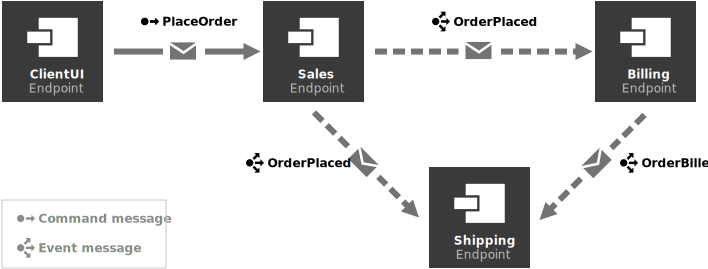

This sample shows the usage of the Particular Service Platform with an existing MassTransit system.

> [!NOTE]
> This sample uses RabbitMQ as the messaging infrastructure. Refer to [the setup documentation](https://docs.particular.net/servicecontrol/masstransit/#settings) for Azure Service Bus setup instructions.

## Walkthrough

The sample consists of 4 applications hosting MassTransit message producers and consumers that implement a simplified order processing logic from an e-commerce system.



`ClientUI` application generates `PlaceOrder` messages that trigger follow-up message flows in the other parts of the system.

### Experiencing failures

In the UI, press the `Run scenario` button. This will generate a set of `PlaceOrder` messages, configured to fail at different consumers through the showcase.
For example, whenever the `Billing` consumer fails to process a message, the message is moved to the `bill-order_error` queue.

```code
fail: MassTransit.ReceiveTransport[0]
      R-FAULT rabbitmq://localhost/bill-order b4950300-b188-ac74-36f6-08dcf7ec3b26 Messages.OrderPlaced Billing.BillOrderConsumer(00:00:00.2819272)
      System.Exception: BOOM. A failure occurred
         at Billing.SimulationEffects.SimulatedMessageProcessing(CancellationToken cancellationToken) in C:\git\p\docs-mt-fork\strategy-527.docs.particular.net\samples\servicecontrol\masstransit-recoverability\ServiceControl_5\Billing\SimulationEffects.cs:line 17
         at Billing.BillOrderConsumer.Consume(ConsumeContext`1 context) in C:\git\p\docs-mt-fork\strategy-527.docs.particular.net\samples\servicecontrol\masstransit-recoverability\ServiceControl_5\Billing\Consumers\BillOrderConsumer.cs:line 12
         at MassTransit.DependencyInjection.ScopeConsumerFactory`1.Send[TMessage](ConsumeContext`1 context, IPipe`1 next) in /_/src/MassTransit/DependencyInjection/DependencyInjection/ScopeConsumerFactory.cs:line 22
         at MassTransit.DependencyInjection.ScopeConsumerFactory`1.Send[TMessage](ConsumeContext`1 context, IPipe`1 next) in /_/src/MassTransit/DependencyInjection/DependencyInjection/ScopeConsumerFactory.cs:line 22
         at MassTransit.Middleware.ConsumerMessageFilter`2.MassTransit.IFilter<MassTransit.ConsumeContext<TMessage>>.Send(ConsumeContext`1 context, IPipe`1 next) in /_/src/MassTransit/Middleware/ConsumerMessageFilter.cs:line 48
```

### Handling failures with the Particular Platform

#### Running the sample

To see how the Particular Platfrom improves failed message management, start the containers responsible for running the platform:

### **RabbitMQ**

> [!NOTE]
> The RabbitMQ Broker is started as part of the docker compose process

Run docker command below from the `src` folder in a CLI

```cmd
docker compose -f docker-compose-base.yml -f compose-rabbitmq.yml --env-file rabbit.env up -d
```

## **Azure ServiceBus**

Configure the access to your Azure Service Bus namespace by editing the variables in `src/asb.env`

```env
CONNECTIONSTRING="Endpoint=sb://[NAMESPACE].servicebus.windows.net/;SharedAccessKeyName=[KEYNAME];SharedAccessKey=[KEY]"
```

Run docker command below from the `src` folder in a CLI

```cmd
docker compose -f docker-compose-base.yml -f compose-azure.yml --env-file asb.env up -d
```

This will make the platform monitor error messages for all the consumers in the sample system. Upon failure, any message moved by a MassTransit consumer to an error queue will be ingested by the platform.

#### Inspecting failures

Navigate to [http://localhost:9090](http://localhost:9090), or click the `View in ServicePulse` button to see the details on failures ingested by the platform.


#### Scheduling message reprocessing

Click on the "Failed Messages" button at the top of the page to see all failed messages ingested by the platform, grouped by the exception type and stack trace.


Drill into an existing group to see the list of individual processing failures. Clicking on any of the rows in the list shows detailed information of a given failed message in the headers and message body tabs.

A failed message can be scheduled for reprocessing by clicking the `Retry message` button.


#### Editing messages before reprocessing

Go to the details page for one of the failed messages and click the `Edit & retry` button. The pop-up window shows the headers collection and the message body in two separate tabs.

Navigate to the `Message Body` tab, change the last digit of the `orderId` value, and click "Retry" to schedule the message for reprocessing.

> [!WARNING]
> Changing or deleting header values may change or cause issues with the subsequent re-processing. It is recommended that these values are not changed if you are unsure of their purpose.


