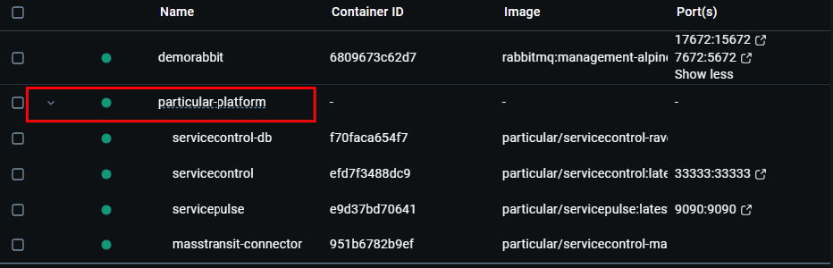

# Running against your own Azure Service Bus system

If you encounter any issues running the steps below, try the [troubleshooting](#troubleshooting) section or post a question on [our forum](https://discuss.particular.net/tag/masstransit).

1. Open a terminal and run the following command to shut down the showcase containers if they are running:
   ```cmd
   docker compose -p particular-platform-showcase -f docker-compose-base.yml -f compose-azure.yml --env-file asb.env down
   ```
   All of the containers should be shown as `Removed` and there should no longer be any containers running under `particular-platform-showcase` in docker.

   

1. Open the `src/asb.env` file, located in the folder that the showcase is cloned to, in an editor and update the `CONNECTION_STRING` to point to your own Azure Service Bus namespace.
1. To validate that the broker can be reached, run the following command:
   ```cmd
   docker run --env-file asb.env --rm particular/servicecontrol-masstransit-connector:latest health-check
   ```
1. Update the list of queues you want to monitor by editing the `src/queues.txt` file, also located in the folder that the showcase is cloned to. Remember that Azure Service Bus queue names are all lowercase.
   To automate this task you can run the following CLI command:
   ```cmd
   docker run --env-file asb.env --rm particular/servicecontrol-masstransit-connector:latest queues-list
   ```
   The command above will output a list of queues, that can be copy-paste into the `src/queues.txt`. **Please ensure you review this list**.
1. Run the following command to start the required containers with the updated environment settings:
   ```cmd
   docker compose -p particular-platform -f docker-compose-base.yml --env-file asb.env --profile infrastructure up -d
   ```

   ServiceControl should show a status of `Healthy`.

   .
   
   Docker should now show a `particular-platform` container group.
   
   

1. Verify that the setup was correct by navigating to http://localhost:9090/#/configuration/mass-transit-connector.
   - All of the configured queues for your system should show here.
   - For each row in the list of queues: if the queues exist, the status should be green. If the queues don't exist, i.e. there have never been any errors on that consumer, or if there is an issue connecting to the broker then the status will be red.
     - If the status is red, the reason for this can be found in the log entries shown below the queue list.
   - Any messages that existed in the error queues should now have been ingested, and will be shown in [Failed Messages](http://localhost:9090/#/failed-messages/all-failed-messages).
