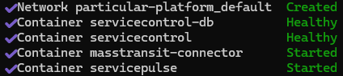

# Running with your own RabbitMQ system

If you encounter any issues running the steps below, try the [troubleshooting](#troubleshooting) section or ask on [our forum](https://discuss.particular.net/tag/masstransit).

1. Open a terminal and run the following command to shut down the showcase containers:

   ```cmd
   docker compose -p particular-platform-showcase -f docker-compose-base.yml -f compose-rabbitmq.yml --env-file rabbit.env down
   ```

   All of the containers should be shown as `Removed` and there should no longer be any containers running under `particular-platform-showcase` in docker

   

2. Open `src/rabbit.env` file, located in the folder that the showcase is cloned to, in an editor and update the RabbitMQ configuration to point to your own RabbitMQ instance.
   - `CONNECTION_STRING` A special connection string to connect to RabbitMQ, see https://docs.particular.net/servicecontrol/transports#rabbitmq for syntax format. NOTE: if your RabbitMQ instance is hosted locally in docker, your connection string will be `host=host.docker.internal;port=<external_docker_port_for_5672>`
   - `RABBITMQ_MANAGEMENT_API_URL` The management API URL. NOTE: as above, if hosted locally in docker this will be `http://host.docker.internal:<external_docker_port_for_15672>`
   - `RABBITMQ_MANAGEMENT_API_USERNAME` The management API username.
   - `RABBITMQ_MANAGEMENT_API_PASSWORD` The management API password.
3. Update the list of queues you want to monitor by editing the `src/queues.txt` file, also located in the folder that the showcase is cloned to. RabbitMQ is case-sensitive so make sure the names are exact. e.g. `myqueue_error`.
4. Run the following command to start the required containers with the updated environment settings:

   ```cmd
   docker compose -p particular-platform -f docker-compose-base.yml -f compose-rabbitmq-user.yml --env-file rabbit.env --profile infrastructure up -d
   ```

   ServiceControl should show a status of `Healthy`

   .

   Docker should now show a `particular-platform` container group

   

5. Verify that the setup was correct by navigating to http://localhost:9090/#/configuration/mass-transit-connector.
   - All of the configured queues for your system should show here.
   - For each row in the list of queues: if the queues exist, the status should be green. If the queues don't exist, i.e. there have never been any errors on that consumer, or if there is an issue connecting to the broker then the status will be red.
     - If the status is red, the reason for this can be found in the log entries shown below the queue list.
   - Any messages that existed in the error queues should now have been ingested, and will be shown in [Failed Messages](http://localhost:9090/#/failed-messages/all-failed-messages).

## Troubleshooting

-
-
