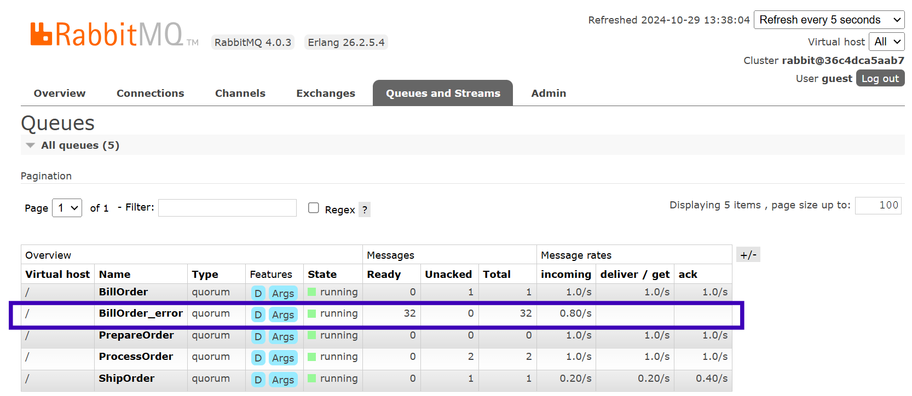
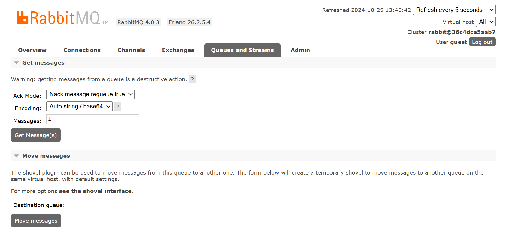

This sample shows the usage of the Particular Service Platform with an existing MassTransit system.

>[!NOTE]
>This sample uses RabbitMQ as the messaging infrastructure. Refer to [the setup documentation](/servicecontrol/masstransit/#settings) for Amazon SQS and Azure Service Bus setup instructions.

## Download the sample

The sample doesn't require a message queue or database to install - only a compatible IDE. To get started:

downloadbutton

## Run the sample

Running the sample requires two steps:

1. Execute `docker compose up -d` in the root directory of the sample to start the RabbitMQ broker
2. Open the `MassTransitShowcaseDemo.sln` solution and start `ClientUI`, `Billing`, `Sales`, and `Shipping` projects.

## Walkthrough

The sample consists of 4 console applications hosting MassTransit message producers and consumers that implement a simplified order processing logic from an e-commerce system.


`ClientUI` application generates `PlaceOder` messages at continuous rate that trigger follow-up message flow in the other parts of the system.

### Experiencing failures

All consumers provide ability to change message processing failure rate by pressing <kbd>I</kbd> to increase and <kbd>D</kbd> to decrease it. Each consumer application shows a list of available commands and a summary of currently used configuration values.

The initial value for the failure rate for each each endpoint is `0`, except for the `Billing` for which the value is `50`%:

```code
Billing Endpoint
Press I to increase the simulated failure rate
Press D to decrease the simulated failure rate
Press R to reset simulation
Press CTRL+C to quit

Failure rate: 50%
```

Whenever the `Billing` consumer fails to process a message, a log entry gets printed to the command line window, and the message is moved to the `BillOrder_error` queue.

```code
fail: MassTransit.ReceiveTransport[0]
      R-FAULT rabbitmq://localhost/BillOrder b4950300-b188-ac74-36f6-08dcf7ec3b26 Messages.OrderPlaced Billing.BillOrderConsumer(00:00:00.2819272)
      System.Exception: BOOM. A failure occurred
         at Billing.SimulationEffects.SimulatedMessageProcessing(CancellationToken cancellationToken) in C:\git\p\docs-mt-fork\strategy-527.docs.particular.net\samples\servicecontrol\masstransit-recoverability\ServiceControl_5\Billing\SimulationEffects.cs:line 17
         at Billing.BillOrderConsumer.Consume(ConsumeContext`1 context) in C:\git\p\docs-mt-fork\strategy-527.docs.particular.net\samples\servicecontrol\masstransit-recoverability\ServiceControl_5\Billing\Consumers\BillOrderConsumer.cs:line 12
         at MassTransit.DependencyInjection.ScopeConsumerFactory`1.Send[TMessage](ConsumeContext`1 context, IPipe`1 next) in /_/src/MassTransit/DependencyInjection/DependencyInjection/ScopeConsumerFactory.cs:line 22
         at MassTransit.DependencyInjection.ScopeConsumerFactory`1.Send[TMessage](ConsumeContext`1 context, IPipe`1 next) in /_/src/MassTransit/DependencyInjection/DependencyInjection/ScopeConsumerFactory.cs:line 22
         at MassTransit.Middleware.ConsumerMessageFilter`2.MassTransit.IFilter<MassTransit.ConsumeContext<TMessage>>.Send(ConsumeContext`1 context, IPipe`1 next) in /_/src/MassTransit/Middleware/ConsumerMessageFilter.cs:line 48
```

### Handling failures using native tools

Failed messages can be accessed using RabbitMQ Management console. Navigate to [queue list](http://localhost:15672/#/queues) (use `guest` for username and password) and click on the corresponding row to see summary information for the the `BillOrder_error` queue.



For any individal error queue, the built-in tooling enables:
- peeking failed messages from the head of the queue,
- moving all messages in the error queue to some other location



### Handling failures with the Particular Platform

#### Starting the platform

In order, to see how the Particular Platfrom improves the failed messages management, start the containers responsible for running the platform:

```bash
docker compose --profile platform  up -d
```

This will make the platform monitor error messages for all the consumers in the sample system. Upon failure any moved by a MassTransit consumer to an error queue will be ingest and index by the platform.

#### Inspecting failures

Navigate to [http://localhost:9090](http://localhost:9090) to see the details on the failures ingested by the platform.


#### Scheduling message reprocessing

Click on the "Failed Messages" button at the top of the page to see all failed messages ingested by the platform grouped by the exception trype and stack trace.


Drilling into an existing group to see the list of individual processing failures. Clicking on any
of the rows in the list shows detailed information on a given failed message in the headers and message body tabs.

A failed message can be scheduled for reprocessing by clicking the `Retry message` button.


When messages get moved back to the input queue of the consumer and successfully reprocessed, this is indicated by a green rectangle (🟩) in the console output.


#### Editing messages before reprocessing

Go to the details page for one of the failed messages and click the `Edit & retry` button at the top. The pop-up window shows the headers collection and the message body in two separate tabs.

Navigate to the `Message Body` tab, change the last digit of the `orderId` value, and click "Retry" to schedule the message for reprocessing.

